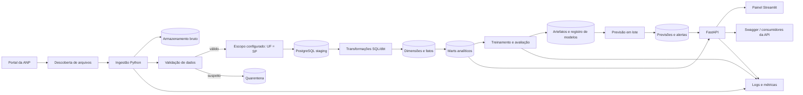
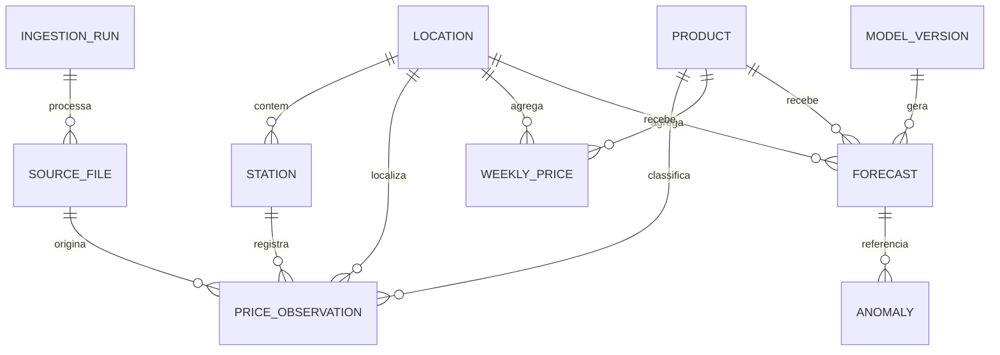
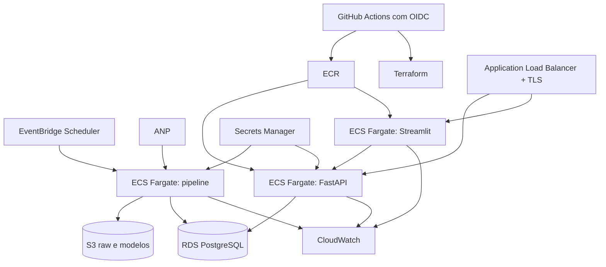

# Radar de Combustíveis SP

## Documento de arquitetura do produto

**Status:** Aceito para implementação  
**Versão:** 1.1  
**Data:** 26 de setembro de 2026  
**Objetivo:** projeto pessoal de portfólio para Ciência de Dados e Machine Learning Engineering

---

## 1. Resumo do produto

O Radar de Combustíveis SP será uma aplicação pública que transforma os levantamentos de preços da Agência Nacional do Petróleo, Gás Natural e Biocombustíveis (ANP) referentes ao estado de São Paulo em informações pesquisáveis e previsões semanais.

A primeira versão cobre somente São Paulo. A ingestão, o modelo de dados e as interfaces preservam a unidade federativa como dimensão configurável para permitir expansão posterior aos demais estados sem reconstruir o núcleo do sistema.

O usuário poderá:

- consultar os preços pesquisados mais recentes por produto e município paulista;
- comparar municípios, bandeiras e produtos dentro de São Paulo;
- visualizar evolução histórica, distribuição e quantidade de postos pesquisados;
- consultar previsões de uma a quatro semanas, sempre acompanhadas de intervalo de incerteza;
- identificar variações estatisticamente incomuns;
- verificar a data da pesquisa, a atualização da fonte e a cobertura da amostra;
- acessar os mesmos dados por uma API documentada.

O projeto deve demonstrar um fluxo completo de dados e machine learning:

1. coleta automatizada;
2. armazenamento do arquivo original;
3. validação e transformação;
4. modelagem SQL;
5. análise exploratória;
6. treinamento com validação temporal;
7. disponibilização por API;
8. painel interativo;
9. implantação com contêineres;
10. testes, integração contínua e monitoramento.

### Proposta de valor em uma frase

> Uma plataforma que mostra como os preços de combustíveis pesquisados pela ANP estão mudando no estado de São Paulo e estima sua evolução nas próximas semanas, deixando claras a fonte, a cobertura e a incerteza, com arquitetura preparada para expansão nacional.

---

## 2. Limites importantes do produto

O painel deve comunicar claramente estas restrições:

- Os dados representam uma pesquisa da ANP; não são preços em tempo real.
- A pesquisa não cobre necessariamente todos os postos de um município.
- O posto pode alterar o preço depois da data de coleta.
- Ausência de uma cidade ou posto não significa ausência de atividade comercial.
- Uma variação incomum é um alerta estatístico; não é prova de irregularidade.
- A previsão é uma estimativa, não uma recomendação financeira ou garantia de preço.
- O campo de preço de compra possui cobertura histórica limitada e não deve ser a base do primeiro modelo.
- A cobertura inicial está limitada ao estado de São Paulo; o produto não deve apresentar seus resultados como representativos de todo o Brasil.
- Agentes de IA e interfaces conversacionais não fazem parte deste produto nem do roadmap atual.

Esses limites devem aparecer no README, na página de metodologia e junto aos resultados mais sensíveis.

---

## 3. Usuários e principais jornadas

### 3.1 Consumidor

**Pergunta:** “Qual foi o preço pesquisado mais recentemente para gasolina em Campinas?”

Jornada:

1. seleciona produto e município paulista;
2. vê mediana, média, mínimo, máximo e número de postos da amostra;
3. vê a data da coleta e da última atualização;
4. consulta uma tabela por posto pesquisado;
5. compara com o agregado estadual e com outros municípios paulistas.

### 3.2 Analista de mercado

**Pergunta:** “Em quais municípios o etanol apresentou a maior alta nas últimas quatro semanas?”

Jornada:

1. escolhe produto e período;
2. ordena municípios por variação absoluta ou percentual;
3. filtra locais com amostra mínima;
4. consulta histórico e cobertura;
5. exporta o recorte em CSV.

### 3.3 Recrutador ou avaliador técnico

**Pergunta:** “Esse projeto vai além de um notebook?”

Jornada:

1. acessa uma demonstração pública;
2. testa a API pelo Swagger;
3. consulta diagrama, modelo de dados e decisões de arquitetura;
4. verifica testes e pipeline de integração contínua;
5. abre o relatório de avaliação do modelo;
6. confere atualização automática e observabilidade.

---

## 4. Escopo por versão

### 4.1 MVP

O MVP deve entregar:

- carga histórica inicial dos combustíveis automotivos para São Paulo;
- atualização idempotente dos arquivos mais recentes;
- recorte configurável por UF, inicialmente fixado em `SP`;
- filtros por município, produto e período;
- estatísticas de preço por semana;
- comparação entre municípios paulistas e o agregado estadual;
- histórico em gráfico;
- tabela de postos pesquisados com data da coleta;
- API REST somente para leitura;
- painel Streamlit;
- PostgreSQL;
- Docker Compose para execução local;
- testes automatizados;
- documentação completa;
- demonstração pública.

### 4.2 Versão de portfólio completa

Adicionar:

- previsão de uma a quatro semanas;
- intervalos de previsão;
- detecção de variações incomuns;
- rastreamento de experimentos e versões de modelo;
- atualização automatizada;
- implantação em nuvem;
- monitoramento de dados, modelo e API;
- infraestrutura como código;
- painel de qualidade e cobertura dos dados.

### 4.3 Evoluções futuras

- expansão gradual para outros estados, começando por UFs limítrofes ou de maior demanda;
- cobertura nacional, condicionada à validação de qualidade, custo e desempenho;
- GLP P13;
- mapas municipais usando códigos ou malhas do IBGE;
- comparação entre etanol e gasolina com cálculo de paridade;
- enriquecimento com IPCA, petróleo ou dados tributários;
- alertas pessoais;
- aplicativo móvel;
- geocodificação de postos, após avaliação de qualidade e termos do provedor.

### 4.4 Estratégia de expansão nacional

A expansão geográfica será incremental. Uma nova UF só deve ser ativada depois que:

1. o contrato de dados for validado com uma amostra real da UF;
2. as regras de qualidade e cobertura forem avaliadas;
3. os testes de ingestão, agregação e API passarem com a nova configuração;
4. o custo e o tempo de processamento permanecerem dentro das metas;
5. painel e documentação exibirem corretamente a nova cobertura.

A ativação ocorre por uma lista central como `TARGET_UFS=["SP", "RJ"]`. Nenhuma regra de negócio deve assumir que São Paulo será a única UF para sempre. Métricas de qualidade, monitoramento e modelos devem continuar segmentáveis por UF, embora somente `SP` seja publicado no MVP.

---

## 5. Requisitos funcionais

| Código | Requisito | Prioridade |
|---|---|---:|
| RF-01 | Importar dos arquivos históricos da ANP as observações do estado de São Paulo | Obrigatório |
| RF-02 | Descobrir e importar novas publicações | Obrigatório |
| RF-03 | Detectar uma nova versão de arquivo já conhecido | Obrigatório |
| RF-04 | Preservar o arquivo original e seu checksum | Obrigatório |
| RF-05 | Validar esquema, tipos, datas e valores | Obrigatório |
| RF-06 | Quarentenar linhas suspeitas sem apagá-las | Obrigatório |
| RF-07 | Produzir agregações semanais | Obrigatório |
| RF-08 | Consultar preços atuais e históricos | Obrigatório |
| RF-09 | Comparar municípios paulistas e o agregado estadual | Obrigatório |
| RF-10 | Informar tamanho e cobertura da amostra | Obrigatório |
| RF-11 | Gerar previsões com incerteza | Versão completa |
| RF-12 | Detectar variações incomuns | Versão completa |
| RF-13 | Disponibilizar API documentada | Obrigatório |
| RF-14 | Exibir data de atualização e saúde da fonte | Obrigatório |
| RF-15 | Exportar resultados agregados em CSV | Desejável |
| RF-16 | Manter a UF como parâmetro de configuração e dimensão de dados para expansão futura | Obrigatório |
| RF-17 | Rejeitar ou sinalizar consultas de UFs ainda não publicadas | Obrigatório |

---

## 6. Requisitos não funcionais

### 6.1 Metas iniciais

| Dimensão | Meta |
|---|---|
| Atualização | dados publicados no produto em até 24 horas após a detecção do arquivo da ANP |
| Idempotência | executar a mesma carga duas vezes não duplica observações |
| Auditabilidade | toda observação aponta para um arquivo, checksum e execução de carga |
| Latência | percentil 95 abaixo de 500 ms para consultas agregadas comuns |
| Disponibilidade | melhor esforço, com meta de 99% para a demonstração pública |
| Recuperação | reconstruir tabelas derivadas a partir dos arquivos brutos |
| Segurança | segredos fora do repositório, TLS e permissões mínimas |
| Qualidade | nenhuma publicação quando falhar uma regra crítica de esquema |
| Reprodutibilidade | ambiente local sobe por um comando documentado |
| Custo | tarefas de ingestão e treinamento executam sob demanda e terminam após o trabalho |

### 6.2 Escala considerada

Arquitetura dimensionada inicialmente para:

- dados históricos e semanais do estado de São Paulo, com margem para milhões de observações;
- atualização semanal;
- treinamento mensal;
- até 50 requisições por segundo em picos;
- poucos usuários simultâneos na demonstração de portfólio.

O sistema não precisa de processamento contínuo de eventos. Execuções em lote atendem à frequência da fonte.

A expansão nacional deve ocorrer por configuração e aumento de capacidade, preservando contratos, chaves, tabelas e endpoints. Ela não faz parte da definição de pronto do MVP paulista.

---

## 7. Fontes de dados

### 7.1 Fonte principal

**ANP — Levantamento de Preços de Combustíveis.**

Uso recomendado:

- arquivos históricos em CSV, agrupados por mês ou semestre, para a carga inicial;
- arquivo semanal por posto revendedor, normalmente em XLSX, para a atualização incremental;
- metadados oficiais para o contrato de dados.

Os arquivos originais podem conter dados nacionais e devem ser preservados integralmente na camada raw. Depois da normalização da UF, apenas registros de São Paulo seguem para as camadas staging, core e marts no MVP. O filtro deve vir de configuração, com valor inicial `SP`, e não ficar espalhado pelo código.

Campos relevantes publicados pela fonte:

- região;
- estado;
- município;
- revenda;
- CNPJ da revenda;
- endereço;
- produto;
- data da coleta;
- valor de venda;
- valor de compra, quando disponível;
- unidade de medida;
- bandeira.

### 7.2 Fonte auxiliar

**IBGE — municípios e geografia.**

Uso:

- associar município e UF a um código estável;
- resolver variações de grafia;
- produzir mapas por município ou estado;
- usar centroides municipais quando a visualização geográfica exigir um ponto aproximado.

### 7.3 Dados derivados

- semana de referência;
- média, mediana e quantis;
- número de postos e observações;
- variação semanal e em quatro semanas;
- diferença para a mediana estadual de São Paulo;
- lags e médias móveis;
- previsão e intervalos;
- escore de variação incomum;
- indicadores de cobertura.

---

## 8. Arquitetura lógica



### Decisão central

Usar um **monólito modular em um único repositório**, com três processos executáveis independentes:

1. pipeline em lote;
2. API;
3. painel.

Eles compartilham modelos de domínio, configuração e banco de dados, mas podem ser implantados e escalados separadamente.

---

## 9. Fluxo completo dos dados

### 9.1 Carga histórica

1. O pipeline lê um manifesto de URLs históricas.
2. Baixa cada arquivo com timeout e tentativas limitadas.
3. Calcula SHA-256 do conteúdo.
4. Registra URL, período, horário, tamanho e checksum.
5. Armazena o arquivo original sem modificações.
6. Detecta codificação, delimitador e esquema esperado.
7. Normaliza nomes de colunas e tipos.
8. Normaliza e valida a UF.
9. Seleciona registros de São Paulo por configuração.
10. Executa regras de qualidade sobre o recorte publicado.
11. Envia linhas suspeitas para quarentena.
12. Carrega linhas aceitas em staging.
13. Executa transformações SQL.
14. Publica marts somente após sucesso de todas as etapas críticas.

### 9.2 Atualização semanal

1. Um agendador executa diariamente uma verificação leve.
2. O descobridor identifica links de semanas ainda não processadas.
3. Se a URL já existe e o checksum é igual, encerra sem alteração.
4. Se o período é novo, cria uma nova versão de fonte.
5. Se o período já existe e o checksum mudou, registra uma revisão.
6. A nova versão é processada em staging.
7. A substituição do período derivado ocorre em uma transação.
8. As métricas de cobertura são recalculadas.
9. As previsões são atualizadas.
10. A API passa a retornar a nova data de referência.

### 9.3 Política de falha

- Erro de rede: repetir com espera exponencial e manter a versão anterior publicada.
- Mudança de esquema: preservar o arquivo, interromper a publicação e gerar alerta.
- Falha parcial de qualidade: carregar dados válidos, manter suspeitos em quarentena e marcar cobertura reduzida.
- Falha no treinamento: conservar o último modelo aprovado.
- Falha no painel: a API continua funcionando.
- Falha na API: os arquivos e banco permanecem íntegros para recuperação.

---

## 10. Camadas de dados

### 10.1 Raw

Arquivos exatamente como recebidos.

Exemplo de chave:

```text
raw/anp/fuel-prices/reference_year=2026/reference_week=2026-09-20/
  retrieved_at=2026-09-26T10-00-00Z/source.xlsx
```

Regras:

- imutável;
- versionado por checksum e horário de coleta;
- nunca sobrescrito;
- retido para auditoria e reprocessamento.

### 10.2 Staging

Representação próxima da fonte, com:

- colunas padronizadas em `snake_case`;
- CNPJ e CEP tratados como texto;
- data em formato nativo;
- preço em decimal;
- hash da linha;
- referência ao arquivo de origem;
- status de validação.

### 10.3 Core

Modelo dimensional com localidade, produto, posto e observações.

### 10.4 Marts

Tabelas voltadas ao produto:

- preços semanais por município e produto;
- agregado semanal do estado de São Paulo por produto;
- últimos preços por posto;
- comparação de localidades;
- cobertura semanal;
- features de treinamento;
- previsões;
- variações incomuns.

---

## 11. Modelo de dados



### 11.1 Tabelas operacionais

#### `ingestion_run`

| Campo | Tipo | Uso |
|---|---|---|
| `run_id` | UUID | identificador da execução |
| `started_at` | timestamptz | início |
| `finished_at` | timestamptz | término |
| `status` | text | running, success, warning ou failed |
| `code_sha` | text | commit executado |
| `rows_read` | bigint | linhas lidas |
| `rows_accepted` | bigint | linhas aceitas |
| `rows_quarantined` | bigint | linhas suspeitas |
| `error_summary` | text | resumo sanitizado |

#### `source_file`

| Campo | Tipo | Uso |
|---|---|---|
| `source_file_id` | UUID | identificador |
| `run_id` | UUID | execução |
| `source_url` | text | URL oficial |
| `reference_start` | date | início do período |
| `reference_end` | date | fim do período |
| `retrieved_at` | timestamptz | data de download |
| `sha256` | text | identidade do conteúdo |
| `storage_uri` | text | caminho do arquivo bruto |
| `revision` | integer | versão daquele período |
| `is_current` | boolean | versão vigente |

### 11.2 Dimensões

#### `dim_location`

- `location_id`;
- `ibge_code`, quando resolvido;
- `municipality_name`;
- `municipality_name_normalized`;
- `uf`;
- `region`;
- `latitude_centroid`, opcional;
- `longitude_centroid`, opcional.

No MVP, `uf` contém somente `SP` nas camadas publicadas, mas permanece no contrato, nas chaves pertinentes e na API para que a expansão não exija uma migração estrutural.

#### `dim_product`

- `product_id`;
- `source_name`;
- `canonical_name`;
- `category`;
- `unit`;
- `active`.

#### `dim_station`

- `station_id`;
- `cnpj`, como texto;
- `trade_name`;
- `brand`;
- `address`;
- `neighborhood`;
- `postal_code`;
- `location_id`;
- `first_seen_at`;
- `last_seen_at`.

### 11.3 Fato principal

#### `fact_price_observation`

- `observation_id`;
- `source_file_id`;
- `station_id`;
- `location_id`;
- `product_id`;
- `collection_date`;
- `week_start`;
- `sale_price` como `numeric`, evitando ponto flutuante para moeda;
- `purchase_price`, opcional;
- `source_row_hash`;
- `quality_status`;
- `is_current_source_revision`.

Índices recomendados:

- `(location_id, product_id, collection_date)`;
- `(station_id, product_id, collection_date)`;
- `(week_start, product_id)`;
- índice único controlado por `source_row_hash` e versão da fonte.

### 11.4 Marts

#### `mart_weekly_city_price`

- `week_start`;
- `location_id`;
- `product_id`;
- `observation_count`;
- `station_count`;
- `price_min`;
- `price_p25`;
- `price_median`;
- `price_mean`;
- `price_p75`;
- `price_max`;
- `price_stddev`;
- `coverage_ratio`;
- `quality_flag`.

#### `model_version`

- nome e versão do modelo;
- commit do código;
- hash do conjunto de dados;
- período de treino;
- parâmetros;
- métricas por corte temporal, produto e município paulista;
- localização do artefato;
- status: candidate, approved, rejected ou archived.

#### `forecast`

- versão do modelo;
- localidade e produto;
- data de geração;
- semana prevista;
- horizonte;
- previsão central;
- limite inferior;
- limite superior;
- confiança e status de cobertura.

---

## 12. Qualidade dos dados

### 12.1 Regras críticas

Uma falha crítica impede a publicação:

- ausência de coluna obrigatória;
- arquivo vazio;
- formato ilegível;
- nenhuma data dentro do período esperado;
- nenhuma observação válida de preço;
- duplicação causada pela própria carga;
- redução extrema e inexplicada do arquivo inteiro.

### 12.2 Regras de linha

Linhas suspeitas são preservadas em quarentena:

- preço ausente, zero ou negativo;
- data inválida;
- município ou UF ausente;
- produto desconhecido;
- CNPJ malformado;
- unidade incompatível;
- preço muito distante da distribuição histórica do produto.

Valores extremos devem ser marcados antes de qualquer exclusão. Um preço raro pode ser verdadeiro.

### 12.3 Regras de cobertura

Calcular por município, produto e semana:

- número de postos pesquisados;
- variação em relação à mediana das oito semanas anteriores;
- proporção de semanas presentes no período;
- ausência de localidades recorrentes;
- atraso desde a última coleta.

Quando a cobertura estiver baixa:

- exibir aviso no painel;
- impedir ou rebaixar a confiança da previsão;
- excluir o recorte de rankings que exigem comparabilidade;
- registrar a causa quando a fonte publicar uma nota explicativa.

### 12.4 Relatório de qualidade

Cada execução deve produzir:

- resultado por regra;
- contagem de linhas afetadas;
- comparação com a execução anterior;
- amostra sanitizada das falhas;
- decisão final: publicar, publicar com aviso ou bloquear.

Ferramentas recomendadas:

- Pandera para contratos no pipeline Python;
- testes dbt para chaves, relacionamentos e valores aceitos;
- testes SQL específicos para cobertura e duplicidade.

---

## 13. Definições analíticas

### 13.1 Preço principal

Usar a **mediana semanal do preço de venda** como indicador principal. Ela é menos sensível a valores extremos e fácil de explicar.

Exibir também:

- média;
- mínimo e máximo;
- percentis 25 e 75;
- número de observações;
- número de postos.

### 13.2 Variação semanal

```text
(mediana_semana_atual / mediana_semana_anterior) - 1
```

Mostrar `N/D` quando não houver semana anterior comparável ou quando a cobertura for insuficiente.

### 13.3 Paridade etanol/gasolina

```text
mediana_etanol / mediana_gasolina
```

O painel pode apresentar a razão, deixando qualquer regra de decisão como configuração explícita e explicada.

### 13.4 Atualidade

Toda resposta deve incluir:

- `data_as_of`: última data de coleta utilizada;
- `source_retrieved_at`: quando o arquivo foi baixado;
- `station_count`;
- `coverage_status`.

---

## 14. Estratégia de machine learning

### 14.1 Problema

Prever a mediana semanal do preço de venda para cada combinação elegível de município e produto nos próximos quatro horizontes:

- uma semana;
- duas semanas;
- três semanas;
- quatro semanas.

Começar com a previsão agregada de São Paulo, que possui maior cobertura. Liberar previsões municipais somente quando os critérios mínimos forem atendidos.

### 14.2 Elegibilidade inicial

Uma série pode participar quando possuir, como ponto de partida:

- pelo menos 52 semanas históricas;
- dados em pelo menos 80% das semanas do intervalo;
- amostra mediana de pelo menos três postos por semana para município;
- ausência de falha crítica de cobertura nas semanas recentes.

Esses valores devem ser confirmados após a análise exploratória.

### 14.3 Baselines obrigatórios

- último valor observado;
- média móvel de quatro semanas;
- valor da mesma semana do ano anterior, quando houver histórico.

Um modelo mais complexo só é aprovado se superar o melhor baseline de maneira consistente.

### 14.4 Modelo candidato

**LightGBM global**, treinado com várias localidades e produtos.

Features iniciais:

- lags de 1, 2, 4, 8, 13, 26 e 52 semanas;
- média, mediana e desvio móvel;
- variações semanais;
- semana do ano e mês;
- produto, município e indicadores geográficos disponíveis em São Paulo;
- quantidade de postos;
- indicadores de cobertura;
- horizonte da previsão.

Um modelo global aproveita padrões compartilhados e reduz a necessidade de manter milhares de modelos individuais.

### 14.5 Prevenção de vazamento

- features de uma previsão só usam dados disponíveis até a data de corte;
- transformações temporais são calculadas dentro de cada corte;
- o conjunto de teste sempre ocorre depois do treino;
- nenhum preenchimento usa informação futura;
- o hash dos dados e o commit acompanham o experimento.

### 14.6 Validação

Usar backtesting com origem deslizante:

1. treinar até uma data de corte;
2. prever as quatro semanas seguintes;
3. avançar o corte;
4. repetir em várias janelas;
5. consolidar resultados por produto, município, horizonte e nível geográfico dentro de São Paulo.

Evitar divisão aleatória.

### 14.7 Métricas

- MAE em reais por litro, métrica principal;
- WAPE, para comparação entre grupos;
- MASE, para comparação com baseline ingênuo;
- viés médio, para detectar superestimação ou subestimação;
- cobertura dos intervalos de previsão;
- largura média dos intervalos.

### 14.8 Regra de aprovação

Um candidato pode substituir o modelo atual quando:

- melhora o MAE ponderado em pelo menos 5% contra o melhor baseline;
- não apresenta regressão grave em produto ou grupo relevante de municípios;
- mantém viés aceitável;
- cumpre a meta de cobertura do intervalo;
- passa nos testes de reprodutibilidade.

Se nenhum candidato passar, o baseline permanece publicado.

### 14.9 Incerteza

Treinar previsões quantílicas, por exemplo P10, P50 e P90, ou calibrar intervalos a partir dos resíduos do backtesting.

O painel mostra:

- valor central;
- faixa esperada;
- horizonte;
- nível de cobertura do histórico;
- versão do modelo.

### 14.10 Variações incomuns

Uma variação pode ser marcada quando:

- o valor observado fica fora de um intervalo calibrado;
- o resíduo é grande em relação ao histórico local;
- a mudança absoluta ultrapassa um limite mínimo relevante;
- a amostra possui cobertura suficiente.

O nome exibido será **“variação incomum”**, acompanhado da explicação estatística.

### 14.11 Ciclo do modelo

- recalcular features após cada carga semanal;
- gerar novas previsões semanalmente;
- reavaliar erro quando o valor real chegar;
- retreinar mensalmente ou quando houver degradação;
- manter o último modelo aprovado disponível para rollback.

---

## 15. API REST

### 15.1 Convenções

- prefixo `/api/v1`;
- JSON;
- datas ISO 8601;
- paginação para listas;
- OpenAPI gerado pelo FastAPI;
- versão explícita;
- respostas incluem atualidade e cobertura;
- limites máximos para intervalos de consulta.
- `uf` permanece no contrato e aceita somente `SP` enquanto a cobertura publicada estiver restrita a São Paulo.

### 15.2 Endpoints

| Método | Endpoint | Finalidade |
|---|---|---|
| GET | `/health/live` | processo está vivo |
| GET | `/health/ready` | dependências estão prontas |
| GET | `/api/v1/metadata/freshness` | última atualização e fonte |
| GET | `/api/v1/products` | produtos disponíveis |
| GET | `/api/v1/locations` | municípios paulistas disponíveis e UF publicada |
| GET | `/api/v1/prices/latest` | estatística mais recente |
| GET | `/api/v1/prices/history` | série histórica |
| GET | `/api/v1/prices/compare` | comparação de localidades |
| GET | `/api/v1/stations` | postos pesquisados no recorte |
| GET | `/api/v1/forecasts` | previsões e intervalos |
| GET | `/api/v1/anomalies` | variações incomuns |
| GET | `/api/v1/data-quality` | cobertura e avisos |

### 15.3 Exemplo de consulta

```http
GET /api/v1/prices/latest?uf=SP&municipality=Campinas&product=GASOLINA_COMUM
```

### 15.4 Exemplo de resposta

```json
{
  "location": {
    "uf": "SP",
    "municipality": "Campinas"
  },
  "product": "GASOLINA_COMUM",
  "data_as_of": "2026-09-24",
  "source_retrieved_at": "2026-09-25T20:10:00Z",
  "statistics": {
    "min": 0,
    "p25": 0,
    "median": 0,
    "mean": 0,
    "p75": 0,
    "max": 0
  },
  "sample": {
    "observations": 0,
    "stations": 0,
    "coverage_status": "example_only"
  }
}
```

Os zeros acima são marcadores de contrato; não representam preços reais.

### 15.5 Erros

Formato único:

```json
{
  "error": {
    "code": "LOCATION_NOT_FOUND",
    "message": "Município não encontrado na cobertura publicada para São Paulo.",
    "request_id": "..."
  }
}
```

---

## 16. Painel

### 16.1 Página inicial

- última semana disponível;
- cobertura estadual de São Paulo;
- produtos disponíveis;
- variação estadual recente;
- atalhos para municípios populares;
- aviso de que os dados são uma pesquisa.

### 16.2 Explorar município

- filtros de município e produto, com cobertura `SP` visível;
- cartões com mediana, média, faixa e amostra;
- gráfico histórico;
- comparação com o agregado do estado de São Paulo;
- tabela de postos pesquisados;
- botão de download.

### 16.3 Comparar localidades

- duas a cinco localidades;
- preço mediano;
- variação semanal;
- tamanho da amostra;
- gráfico normalizado e em valores absolutos.

### 16.4 Previsão

- histórico real;
- previsão central;
- faixa de incerteza;
- horizonte;
- erro histórico do modelo;
- aviso quando a série não for elegível.

### 16.5 Variações incomuns

- ranking por magnitude;
- filtro de produto, município e período;
- cobertura mínima;
- explicação do critério;
- ligação para o histórico da localidade.

### 16.6 Qualidade e metodologia

- data e URL da fonte;
- número de linhas processadas e em quarentena;
- localidades com cobertura reduzida;
- versão do pipeline e do modelo;
- limitações conhecidas;
- métricas de backtesting.

### 16.7 Diretrizes de experiência

- layout responsivo;
- contraste acessível;
- textos em português;
- valores monetários no formato brasileiro;
- tooltips para métricas;
- gráficos com amostra e data visíveis;
- nenhuma previsão sem intervalo de incerteza.

---

## 17. Stack recomendada

| Camada | Tecnologia | Motivo |
|---|---|---|
| Linguagem | Python 3.12+ | ecossistema de dados e compatibilidade ampla |
| Dependências | uv | ambiente rápido e lockfile reproduzível |
| Manipulação | pandas | aderência às vagas e volume suficiente |
| Contratos | Pandera e Pydantic | validação de dados e API |
| Banco | PostgreSQL | SQL, agregações, índices e maturidade |
| Acesso ao banco | SQLAlchemy e psycopg | separação entre domínio e SQL operacional |
| Migrações | Alembic | evolução controlada do esquema |
| Transformações | dbt Core | SQL testável, documentação e linhagem |
| Modelo | scikit-learn e LightGBM | baselines e boosting global |
| Experimentos | MLflow | métricas, parâmetros e artefatos |
| API | FastAPI | validação e documentação OpenAPI |
| Painel | Streamlit e Plotly | entrega rápida e interativa |
| Testes | pytest | testes unitários e de integração |
| Qualidade do código | Ruff e mypy | lint, formatação e tipos |
| Contêineres | Docker e Docker Compose | paridade local e nuvem |
| CI/CD | GitHub Actions | testes, build e implantação |
| Nuvem | AWS | demonstra S3, contêineres, banco e monitoramento |
| Infraestrutura | Terraform | ambiente reproduzível |

---

## 18. Estrutura do repositório

```text
radar-combustiveis-br/
├── README.md
├── LICENSE
├── pyproject.toml
├── uv.lock
├── .env.example
├── .gitignore
├── Makefile
├── docker-compose.yml
├── Dockerfile
├── docs/
│   ├── architecture.md
│   ├── data-contract.md
│   ├── methodology.md
│   ├── model-card.md
│   ├── runbook.md
│   └── adr/
├── src/radar_combustiveis/
│   ├── config.py
│   ├── domain/
│   ├── ingestion/
│   ├── quality/
│   ├── features/
│   ├── training/
│   ├── forecasting/
│   ├── repositories/
│   ├── api/
│   └── observability/
├── dashboard/
│   ├── Home.py
│   └── pages/
├── dbt/
│   ├── models/staging/
│   ├── models/core/
│   ├── models/marts/
│   └── tests/
├── migrations/
├── tests/
│   ├── unit/
│   ├── integration/
│   ├── contract/
│   └── end_to_end/
├── infra/
│   ├── modules/
│   └── environments/
├── scripts/
└── .github/workflows/
```

### Regra de organização

O notebook é usado para exploração e relatório. A lógica que executa em produção fica em módulos Python testáveis.

---

## 19. Ambiente local

Serviços do Docker Compose:

- `postgres`;
- `api`;
- `dashboard`;
- `mlflow`, na versão completa;
- armazenamento compatível com S3, opcional para simular a nuvem.

Comandos de alto nível esperados:

```text
make setup
make backfill
make quality
make train
make serve
make test
```

O README deve explicar cada comando e fornecer um conjunto reduzido de dados para demonstração local.

---

## 20. Implantação em nuvem



### Componentes

- **ECR:** imagens versionadas pelo commit.
- **ECS Fargate:** API e painel como serviços; ingestão e treino como tarefas que terminam.
- **EventBridge Scheduler:** verificação diária da fonte e treinamento mensal.
- **RDS PostgreSQL:** dados curados, marts e metadados.
- **S3:** arquivos brutos, relatórios e artefatos de modelos.
- **Secrets Manager:** credenciais e configurações sensíveis.
- **CloudWatch:** logs, métricas, painéis e alarmes.
- **ALB + ACM:** roteamento e HTTPS.
- **Terraform:** rede, permissões, serviços e armazenamento.
- **GitHub OIDC:** implantação sem chave AWS permanente no GitHub.

### Alternativa econômica para a primeira demonstração

Durante o MVP, usar:

- um PostgreSQL gerenciado;
- uma plataforma de contêiner para API e painel;
- GitHub Actions para a carga agendada;
- armazenamento de objetos compatível com S3.

Depois da demonstração funcional, migrar para a arquitetura AWS e documentar o processo.

---

## 21. CI/CD

### 21.1 Pull request

Executar:

1. instalação por lockfile;
2. Ruff;
3. mypy;
4. testes unitários;
5. testes de contrato;
6. PostgreSQL temporário para integração;
7. dbt compile e dbt test;
8. construção da imagem Docker;
9. análise de dependências e imagem;
10. publicação do relatório de cobertura.

### 21.2 Branch principal

1. repetir os controles críticos;
2. construir imagem imutável;
3. publicar no registro;
4. executar migração Alembic como tarefa isolada;
5. atualizar API e painel;
6. executar smoke test;
7. reverter para a imagem anterior se o smoke test falhar.

### 21.3 Pipeline de dados

O workflow agendado:

1. verifica nova fonte;
2. ingere;
3. testa qualidade;
4. executa dbt;
5. atualiza previsão;
6. executa smoke tests da API;
7. registra sucesso, aviso ou falha.

---

## 22. Estratégia de testes

### 22.1 Unitários

- normalização de nomes;
- conversão de valores monetários;
- cálculo de semana;
- hashing;
- parsing de datas;
- deduplicação;
- criação de lags sem vazamento;
- métricas de avaliação.

### 22.2 Contrato da fonte

- arquivo mínimo representativo;
- colunas obrigatórias;
- tipos aceitos;
- produtos e unidades conhecidos;
- comportamento diante de coluna nova ou ausente.

### 22.3 Integração

- carga em PostgreSQL;
- migrações;
- atualização de uma semana;
- revisão de um período existente;
- rollback após falha;
- consulta da API contra banco real de teste.

### 22.4 Transformações

- unicidade das chaves;
- relacionamentos entre dimensões e fatos;
- agregação reconciliada com a origem;
- ausência de datas futuras;
- mediana e contagens verificadas em amostra conhecida.

### 22.5 Machine learning

- separação temporal;
- features sem acesso ao futuro;
- baseline reproduzível;
- modelo serializa e carrega;
- previsões possuem limites coerentes;
- regra de aprovação bloqueia regressão.

### 22.6 API

- respostas 200, 404 e 422;
- paginação;
- filtros;
- limites de período;
- esquema OpenAPI;
- metadados de atualidade presentes.

### 22.7 Ponta a ponta

Cenário mínimo:

1. carregar arquivo pequeno;
2. transformar;
3. gerar previsão;
4. iniciar API;
5. consultar endpoint;
6. validar conteúdo exibido no painel.

---

## 23. Observabilidade

### 23.1 Pipeline

Métricas:

- horário da última execução bem-sucedida;
- duração;
- arquivos descobertos e processados;
- linhas lidas, aceitas e em quarentena;
- mudança de esquema;
- idade do dado;
- cobertura por produto e município paulista, com agregação estadual.

### 23.2 API

- requisições por endpoint;
- latência P50, P95 e P99;
- respostas 4xx e 5xx;
- conexões com banco;
- consultas lentas;
- uso de CPU e memória.

### 23.3 Modelo

- versão em produção;
- MAE realizado por horizonte;
- viés;
- cobertura do intervalo;
- distribuição das features;
- porcentagem de séries elegíveis;
- idade do modelo;
- comparação com baseline.

### 23.4 Alertas

- fonte sem atualização além do limite esperado;
- carga falhou;
- esquema mudou;
- queda brusca de linhas ou localidades;
- API com erros elevados;
- banco sem espaço;
- modelo perdeu para o baseline por várias janelas.

---

## 24. Segurança e privacidade

- armazenar CNPJ e CEP como dados de estabelecimento, mantendo a atribuição à fonte pública;
- não coletar dados pessoais de usuários no MVP;
- evitar expor credenciais ou strings de conexão;
- separar usuário de leitura da API e usuário de escrita do pipeline;
- usar conexões criptografadas;
- validar e limitar todos os parâmetros da API;
- limitar tamanho de exportações;
- executar contêineres como usuário sem privilégios;
- fixar versões por lockfile;
- atualizar dependências com automação;
- examinar imagem de contêiner;
- registrar ações administrativas;
- usar permissões mínimas no IAM;
- manter banco em rede privada na implantação AWS;
- usar OIDC no CI/CD.

---

## 25. Controle de custo

- tarefas de ingestão e treino terminam após a execução;
- agregações frequentes ficam materializadas;
- respostas comuns usam índices e cache curto;
- arquivos antigos permanecem em camada de armazenamento barata;
- ambientes de desenvolvimento em nuvem são desligados quando ociosos;
- criar alerta de orçamento antes da implantação;
- medir custo por carga e por mil requisições;
- revisar se o RDS fixo se justifica durante a fase de portfólio.

Cache distribuído não é necessário inicialmente. A primeira otimização deve ser SQL, índices e marts pré-agregados.

---

## 26. Decisões de arquitetura

### ADR-001: monólito modular

**Decisão:** um repositório, módulos separados e processos implantáveis.

**Razão:** reduz operação e mantém separação suficiente para demonstrar engenharia.

**Revisitar quando:** equipes distintas precisarem implantar componentes de forma independente ou houver escala muito diferente entre serviços.

### ADR-002: processamento em lote

**Decisão:** atualização agendada e idempotente.

**Razão:** a fonte possui frequência semanal. Streaming acrescentaria operação sem melhorar a atualidade real.

**Revisitar quando:** o sistema receber preços próprios em tempo quase real.

### ADR-003: S3 mais PostgreSQL

**Decisão:** arquivos originais no armazenamento de objetos; dados tratados e agregados no PostgreSQL.

**Razão:** combina reprocessamento auditável com consultas SQL simples.

**Revisitar quando:** o volume tornar as transformações ou o custo do PostgreSQL inadequados.

### ADR-004: previsão em lote

**Decisão:** gerar e gravar todas as previsões após cada atualização.

**Razão:** baixa latência da API, reprodutibilidade e operação simples.

**Revisitar quando:** usuários solicitarem cenários personalizados em tempo real.

### ADR-005: LightGBM global com baseline obrigatório

**Decisão:** comparar um modelo global de boosting com modelos ingênuos.

**Razão:** trabalha bem com features temporais e categorias, compartilha sinal entre séries e é implantável em CPU.

**Revisitar quando:** o backtesting mostrar que modelos por série ou modelos probabilísticos entregam ganho consistente.

### ADR-006: São Paulo como escopo inicial

**Decisão:** publicar inicialmente somente dados e previsões do estado de São Paulo, mantendo a UF no contrato, no modelo de dados, na configuração e na API.

**Razão:** reduz o escopo de validação e entrega sem retirar as competências centrais demonstradas pelo projeto. São Paulo oferece variedade suficiente de municípios, postos e contextos econômicos para o MVP.

**Revisitar quando:** o MVP paulista estiver estável, atualizado automaticamente e com qualidade observada por período suficiente para justificar a expansão.

### ADR-007: produto sem agentes de IA

**Decisão:** não incluir agentes de IA, chat conversacional, RAG ou orquestração multiagente.

**Razão:** o valor principal vem do pipeline auditável, das consultas determinísticas, da análise estatística e da previsão. Uma camada de agentes aumentaria escopo, custo e dificuldade de avaliação sem resolver uma necessidade essencial do produto.

**Revisitar quando:** somente mediante uma nova necessidade de produto, tratada como iniciativa separada e sem bloquear a expansão geográfica.

---

## 27. Riscos e mitigação

| Risco | Impacto | Mitigação |
|---|---|---|
| Mudança no HTML ou URL da ANP | carga deixa de descobrir arquivo | descobridor isolado, manifesto manual e alerta |
| Mudança no esquema | transformação incorreta | contrato de dados e bloqueio da publicação |
| Arquivo corrigido pela fonte | números divergentes | checksum, revisão e recarga transacional |
| Município sem coleta | gráfico enganoso | indicador de cobertura e lacuna explícita |
| Poucos postos | estatística instável | amostra visível e limiar de elegibilidade |
| Modelo pior que baseline | previsão sem valor | gate automático e fallback para baseline |
| Interpretação de anomalia como fraude | risco reputacional | linguagem estatística e metodologia clara |
| Geocodificação imprecisa | posto no local errado | mapa municipal primeiro; geocodificação validada depois |
| Custo de nuvem | projeto fica caro | tarefas efêmeras, orçamento e implantação em fases |
| Projeto amplo demais | entrega demora | MVP antes de ML e nuvem completa |
| Filtro de SP implementado em vários pontos | expansão exige retrabalho e gera inconsistência | centralizar `TARGET_UFS`, manter UF nos contratos e testar o limite de cobertura |
| Expansão nacional prematura | qualidade e operação se tornam difíceis de validar | concluir a definição de pronto de São Paulo antes de ativar outra UF |

---

## 28. Plano de execução

### Semana 1 — Fundação e descoberta

- criar repositório;
- registrar visão, requisitos e arquitetura;
- baixar uma amostra histórica;
- fazer EDA de esquema, volume, cobertura e qualidade para São Paulo;
- definir contrato de dados;
- definir `TARGET_UFS=["SP"]` como configuração única de cobertura;
- criar ambiente Python e PostgreSQL;
- preparar Docker Compose.

**Entrega:** relatório de dados e arquitetura confirmada.

### Semana 2 — Ingestão

- implementar download, checksum e armazenamento bruto;
- implementar carga histórica;
- preservar o arquivo nacional bruto e publicar somente o recorte paulista;
- criar staging;
- criar regras críticas e quarentena;
- criar tabelas de auditoria;
- testar reexecução idempotente e revisão de arquivo.

**Entrega:** pipeline reproduzível e auditável.

### Semana 3 — SQL e API

- criar dimensões, fato e marts;
- adicionar dbt e testes;
- criar índices;
- implementar endpoints de metadados, localidades, produtos, preço atual e histórico;
- gerar OpenAPI.

**Entrega:** API funcional com dados reais.

### Semana 4 — Painel MVP

- página inicial;
- identificação visível de cobertura limitada a São Paulo;
- exploração por município;
- comparação de localidades;
- tabela de postos;
- qualidade e metodologia;
- exportação;
- testes ponta a ponta.

**Entrega:** MVP demonstrável.

### Semana 5 — Modelagem

- construir features;
- implementar baselines;
- criar backtesting;
- treinar LightGBM;
- calibrar intervalos;
- registrar experimentos;
- escrever model card.

**Entrega:** relatório honesto de desempenho e modelo aprovado ou baseline.

### Semana 6 — MLOps e observabilidade

- previsão em lote;
- detecção de variações incomuns;
- monitoramento de erro e cobertura;
- atualização agendada;
- logs estruturados;
- painéis operacionais.

**Entrega:** fluxo automático completo.

### Semana 7 — Nuvem

- construir Terraform;
- configurar OIDC;
- publicar imagens;
- criar armazenamento, banco e serviços;
- configurar TLS e segredos;
- implantar pipeline agendado;
- configurar alarmes e orçamento.

**Entrega:** URL pública e infraestrutura reprodutível.

### Semana 8 — Apresentação de portfólio

- revisar README;
- adicionar diagrama e screenshots;
- gravar demonstração curta;
- documentar decisões e limitações;
- demonstrar que a expansão de UF é configurável sem afirmar cobertura nacional;
- publicar resultados de backtesting;
- criar roteiro de entrevista;
- executar revisão final de segurança e custos.

**Entrega:** projeto pronto para recrutadores.

---

## 29. Backlog em épicos

### Épico A — Plataforma de dados

- A1: manifesto de fontes;
- A2: cliente HTTP resiliente;
- A3: armazenamento bruto;
- A4: parsing CSV/XLSX;
- A5: idempotência e revisões;
- A6: quarentena;
- A7: backfill.
- A8: filtro configurável de UFs publicadas.

### Épico B — Analytics engineering

- B1: dimensões;
- B2: fatos;
- B3: marts;
- B4: testes dbt;
- B5: documentação e linhagem.

### Épico C — Produto

- C1: API;
- C2: painel;
- C3: comparações;
- C4: exportação;
- C5: metodologia e qualidade.

### Épico D — Machine learning

- D1: dataset de features;
- D2: baselines;
- D3: backtesting;
- D4: modelo global;
- D5: intervalos;
- D6: model registry;
- D7: monitoramento.

### Épico E — Operação

- E1: Docker;
- E2: CI;
- E3: CD;
- E4: Terraform;
- E5: observabilidade;
- E6: runbook;
- E7: controle de custo.

---

## 30. Definição de pronto

O projeto está pronto para o portfólio quando:

- uma pessoa consegue executar localmente seguindo o README;
- a carga histórica e incremental são reproduzíveis;
- somente dados de São Paulo são publicados no MVP, enquanto o raw original permanece íntegro;
- a UF está centralizada em configuração e preservada nos contratos para expansão;
- reexecutar uma carga não duplica dados;
- revisões da fonte são detectadas;
- falhas de qualidade ficam visíveis;
- API e painel estão públicos;
- o painel informa data, fonte e amostra;
- a previsão foi comparada com baselines;
- a validação respeita o tempo;
- o modelo possui card e métricas por segmento;
- testes rodam no GitHub Actions;
- imagem Docker é construída automaticamente;
- segredos não aparecem no repositório;
- arquitetura e decisões estão documentadas;
- existe uma demonstração de dois minutos;
- limitações estão descritas com honestidade.
- agentes de IA não são dependência nem requisito de conclusão.

---

## 31. Roteiro de demonstração para entrevista

1. **Problema:** dados públicos úteis, mas fragmentados em arquivos periódicos.
2. **Produto:** busca, comparação, histórico e previsão para municípios de São Paulo.
3. **Dados:** origem oficial, atualização e limites da amostra.
4. **Engenharia:** raw imutável, checksum, idempotência, dbt e API.
5. **Ciência de Dados:** baseline, validação temporal, métricas e incerteza.
6. **Produção:** Docker, CI/CD, nuvem e monitoramento.
7. **Decisão:** explicar o recorte paulista e como o desenho permite expansão nacional.
8. **Resultado:** demonstrar um município e abrir o Swagger.

---

## 32. Ordem recomendada de implementação

1. EDA real dos arquivos da ANP.
2. Contrato e ingestão histórica.
3. Banco e marts.
4. API.
5. Painel MVP.
6. Atualização automatizada.
7. Baselines e backtesting.
8. Modelo candidato e intervalos.
9. Monitoramento.
10. Implantação AWS e acabamento do portfólio.

Essa ordem produz valor demonstrável cedo e reduz o risco de construir o modelo antes de compreender a qualidade e a cobertura da fonte.

---

## 33. Referências da fonte

- Série histórica de preços de combustíveis e GLP da ANP: <https://www.gov.br/anp/pt-br/centrais-de-conteudo/dados-abertos/serie-historica-de-precos-de-combustiveis>
- Últimas semanas pesquisadas: <https://www.gov.br/anp/pt-br/assuntos/precos-e-defesa-da-concorrencia/precos/levantamento-de-precos-de-combustiveis-ultimas-semanas-pesquisadas>
- Metadados oficiais: <https://www.gov.br/anp/pt-br/centrais-de-conteudo/dados-abertos/arquivos/shpc/metadados-serie-historica-precos-combustiveis-1.pdf>
